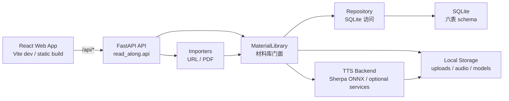

# Read Along 架构说明

本文说明 Read Along 的运行边界、主要模块和数据流。目录级职责见 [code-layout.md](code-layout.md)，测试分层见 [testing.md](testing.md)。

## 高层结构

Read Along 是一个本地优先的 Python + Web 应用：

- FastAPI 后端负责导入、材料库、阅读进度、句子音频缓存和 TTS 调度。
- Vite/React 前端负责书架、阅读页、朗读控制、阅读偏好和浏览器端交互状态。
- SQLite 数据库保存阅读材料身份、结构化正文、句子音频状态和阅读进度。
- 本地文件系统保存 PDF 源文件副本、句子音频缓存和可选 TTS 模型。

## 后端运行边界

`read_along.api.create_app()` 创建 FastAPI 应用。`read-along serve` 在启动前初始化本地数据目录和数据库；现有数据库必须匹配当前 schema 或 ADR 明确记录的受限兼容例外。

`MaterialLibrary` 是后端领域门面，外部调用者通过它完成：

- 保存阅读材料 Draft。
- 读取书架摘要和阅读材料详情。
- 保存阅读进度。
- 获取或生成句子音频。
- 清理材料音频缓存。
- 删除阅读材料及关联本地文件。

`Repository` 只负责 SQLite 读写。它不承担领域决策，例如重复导入如何处理、音频缓存如何校验、阅读材料详情如何装配。

## 前端运行边界

前端只有两个主要路由：

- `/`：书架、导入入口、材料列表和删除操作。
- `/materials/:materialId`：阅读页、句子选择、朗读控制、阅读偏好和禅模式。

前端 API 类型集中在 `web/src/api.ts`。这些类型应反映后端公开响应，不作为独立协议分叉。阅读页中的纯逻辑优先拆到 `readerPageViewModel.ts`、`readerPlaybackTimeline.ts`、`readerAudioPreparation.ts` 和 `readerPlaybackSession.ts` 等可测试模块。

## 数据生命周期

1. 用户导入 URL 或 PDF。
2. 导入器提取标题和正文，生成 `ReadingMaterialDraft`。
3. `MaterialLibrary.save()` 计算结构化正文 hash 和来源身份。
4. 已存在相同来源且正文一致时复用材料；相同正文的新来源会关联到已有材料；同一来源正文变化会拒绝覆盖。
5. 新材料写入 SQLite，PDF 源文件复制到本地 uploads，正文按段落和句子持久化。
6. 阅读页按句子请求音频；缺失或失效时由 TTS 后端生成并写入 audio 缓存。
7. 当前句、句内位置、播放倍速和朗读完成状态保存为阅读进度。

## 关键约束

- 不自动迁移未知数据库 schema。
- 不把用户正文发送给在线服务，除非用户明确配置在线 TTS 后端。
- 音频缓存路径必须保持在本地 audio 根目录内，拒绝符号链接或路径逃逸。
- 前端不直接访问本地文件系统，所有材料和音频都通过 API 获取。
